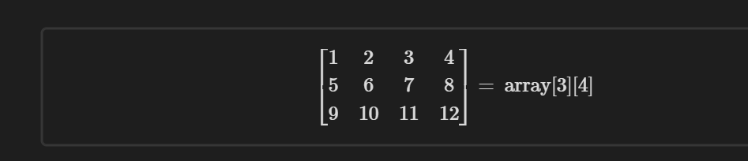

## Arrays
Arrays hold a sequence of numbers marked by values and index


#### Declaring arrays

```java
int[] names;
```

#### Declaring arrays with size
```java
int[] todos = new int[3]; // Contains 3 arrays
// Or
var a= new int[3];
```
>[!tip] Array Definitions 
>You can define an array variable either as
>
>```java
  int[] a;
> 
> or as
>
  int a[]; ```

#### Declaring and Initializing

```java
int[] smallPrimes ={2, 3, 5,7, 11, 13};
```

>What happens when add a trailing comma?
> >The comma indicates that you it is 
> > >
> > > ```java
> > >  int[ ] numbers =[ 1,2,3, 4, ]
> > > ```

#### Anonymous Array

```java
int[] numbers = new int[] { 1, 2,3,4, 5, }
```


### Accessing Array Elements

The array elements are *numbered starting from 0*. The last valid index is one less than the length.
```java
int[] a =new int[100]; 
	for(int i=0;i<100; i++) 
		a[i]=i;//fillsthearraywith numbers0to 99
```

> Empty array
> When you create an array of numbers, all elements are initialized with zero. Arrays of boolean are initialized with false. Arrays of objects are initialized with the special value null, which indicates that they do not (yet) hold any objects.

>
>If you construct an array with 100 elements and then try to access the element a[100] (or any other index outside the range from 0 to 99), an “array index out of bounds” exception will occur

### The “for each” Loop

Java has a powerful looping construct that allows you to loop through each element in an array (or any other collection of elements) without having to fuss with index values.

```java
// Syntax
// # The enhanced for loop 

for(variable : collection) 
	statement
	
for(int element:a) 
	System.out.println(element);
```
>
>The “for each” loop is a pleasant improvement over the traditional loop if you need to process all elements in a collection. However, there are still plenty of opportunities to use the traditional for loop. For example, you might not want to traverse the entire collection, or you may need the index value inside the loop


>Print all values
>There is an even easier way to print all values of an array, using the toString method of the Arrays class. The call *Arrays.toString(a)* returns a string containing the array elements, enclosed in brackets and separated by commas, such as "[2,3,5,7,11,13]". To print the array, simply call 
>``` java
>System.out.println(Arrays.toString(a)); 


### Array Copying

You can copy one array variable into another, but then both *variables refer to the same array*:

```java
int[] luckyNumbers = smallPrimes; 
luckyNumbers[5]= 12;// now smallPrimes[5] is also 12
``````

### Making a new Copy

If you actually want to copy all values of one array into a new array, use the copyOf method in the Arrays class:

```java
int[] copiedLuckyNumbers = Arrays.copyOf(luckyNumbers, luckyNumbers.length);
luckyNumbers=Arrays.copyOf(luckyNumbers,2* luckyNumbers.length);
// double the size
```

### Array Sort
To sort an array of numbers, you can use one of the sort methods in the Arrays 

class:

```java
int[] a= new int[10000]; ... 

Arrays.sort(a)
```

This method uses a tuned version of the *QuickSort* algorithm that is claimed to be very efficient on most data sets.


> API for java.util.Arrays 
> 1. static String toString(xxx[]a)
> 	returns a string with the elements of a, enclosed in brackets and delimited by commas. In this and the following methods, the component type xxx of the array can be int, long, short, char, byte, boolean, float, or double. 
> 2. static xxx[ ] copyOf(xxx[]a, int end) 
> 3. static xxx[ ]copyOfRange(xxx[ ] a, int start, int end) 
> 	returns an array of the same type as a, of length either end or end start, filled with the values of a. If end is larger than a.length, the result is padded with 0 or false values.
> 4. static void sort(xxx[ ]a)
> 	sorts the array, using a tuned QuickSort algorithm.
> 5. static int binarySearch(xxx[ ]a, xxx v)
> 6. static int binarySearch(xxx[ ]a, int start, int end, xxx v )
> 	uses the binary search algorithm to search for the value v in the sorted array a. If v is found, its index is returned. Otherwise, a negative value r is returned; –r – 1 is the spot at which v should be inserted to keep a sorted. 
> 7. static void fill(xxx[ ]a, xxx v) 
> 	sets all elements of the array to v.

Multidimensional arrays use more than one index to access array elements.
Multidimensional arrays are faked as “arrays of arrays.”
 - 2D Multidimensional { Matrix: X, Y}
 - 3D Multidimensional array {Cube, X, Y, Z}
 - Nth Multidimensional Array {Higher Level Dimensionality reduction}

Declaring a two-dimensional array in Java is simple enough.

```java
double[][] balances;
```

Initialize an multidimensional array

```java
balances =newdouble[size][size];

```

Shorthand notation for initializing a multidimensional array

```java
int [] a =[1,2,3,4]
int[][]magicSquare= { 
	{16,3,2,13}, 
	{5,10,11,8}, 
	{9,6,7,12}, 
	{4,15,14,1} 
	};
int[R][C]
```


Accessing the arrays

```java
for(int i=1; i < balances. length; i++){
	for (int j = 1; j< balances[i].length; j++){
	System.out.print(j, i)
	}
}
```

### Two D Arrays

```java
int[][] myArray = {
    {1, 2, 3, 4},
    {5, 6, 7, 8},
    {9, 10, 11, 12}
};
``````


1. **Type Declaration:** `int[][]` indicates that `myArray` is a two-dimensional array of integers. The first `[]` denotes the first dimension (rows), and the second `[]` denotes the second dimension (columns).

2. **Variable Name:** `myArray` is the name of the variable that refers to the array.

3. **Initialization:** The array is being initialized with specific values immediately upon declaration. The curly braces `{}` contain the values of the array, and each inner set of curly braces represents a row in the two-dimensional array.

    - `{1, 2, 3, 4}` is the first row.
    - `{5, 6, 7, 8}` is the second row.
    - `{9, 10, 11, 12}` is the third row.

4. **Structure:** This array can be visualized as a table with 3 rows and 4 columns:

    ```java
    myArray[0][0] = 1; myArray[0][1] = 2; myArray[0][2] = 3; myArray[0][3] = 4;
    myArray[1][0] = 5; myArray[1][1] = 6; myArray[1][2] = 7; myArray[1][3] = 8;
    myArray[2][0] = 9; myArray[2][1] = 10; myArray[2][2] = 11; myArray[2][3] = 12;
    ```

    - `myArray[0][0]` would give you `1`
    - `myArray[0][1]` would give you `2`

5. **Usage:** You can access each element of this array using two indexes - one for the row and one for the column. For example, `myArray[0][2]` would access the element `3` (first row, third column).

6. **Semi-colon (`;`):** The declaration and initialization end with a semi-colon, as is required for statements in Java.

```java
int[][] myArray = new int[][] {
    {1, 2, 3, 4},
    {5, 6, 7, 8},
    {9, 10, 11, 12}
};
``````


### 3d Array
A three-dimensional (3D) array in Java  is an array of arrays of arrays. It's a collection that allows you to store elements in a grid with three dimensions.

### Declaration and Instantiation:

You declare a 3D array by specifying three sets of square brackets `[][][]`. To instantiate it, you use the `new` keyword followed by the type of data the array will hold and the size of each dimension:

```java
int[][][] my3DArray = new int[2][3][4]; // 2 blocks, each containing 3 rows, each containing 4 columns
```

This line creates a 3D array with 2 "blocks" (or layers), each block containing a 2D array with 3 rows and 4 columns. Initially, all elements are set to zero (the default value for the `int` type).

### Initialization:

If you want to explicitly initialize a 3D array with specific values, you can use nested curly braces:

```java
int[][][] my3DArray = new int[][][] {
    { // Block 1
        {1, 2, 3, 4},    // Row 1
        {5, 6, 7, 8},    // Row 2
        {9, 10, 11, 12}  // Row 3
    },
    { // Block 2
        {13, 14, 15, 16}, // Row 1
        {17, 18, 19, 20}, // Row 2
        {21, 22, 23, 24}  // Row 3
    }
};
``````

In this example:

- `my3DArray[0]` refers to the first block (2D array).
- `my3DArray[0][0]` refers to the first row of the first block.
- `my3DArray[0][0][0]` refers to the first element of the first row of the first block, which is `1`.

You can use three indices to access or modify each individual element in the 3D array. For instance, `my3DArray[1][2][3]` would access the element `24` (second block, third row, fourth column).

3D arrays are useful in scenarios where you need to work with multi-dimensional data structures, like 3D graphics, complex simulations, or handling data in three-dimensional space.

### For Each loop in Multidimensional Array

```java
for(double[] row :a) 
	for(doublevalue:row)
		dosomething with value
```

To print out a quick-and-dirty list of the elements of a two-dimensional array, call 

```java
System.out.println(Arrays.deepToString(a)); 
```

The output is formatted like this:
```java
[[16,3,2, 13],[5,10,11,8],[9,6, 7,12], [4, 15,14,1]]
```

```java
class HelloWorld {
    public static void main(String[] args) {
        for(int i =1; i< 5; i++){
            String star = "";
            for( int j=1; j<i; j++){
                star= star + '*';
            }
            System.out.println(star);
        }
        for(int i =5; i>1; i--){
            String star = "";
            for( int j=i; j>1; j--){
                star= star + '*';
            }
            System.out.println(star);
        }
    }
}
```
Example for component interest

```java
public class CompoundInterest
{
   public static void main(String[] args)
   {
      final double STARTRATE = 10;
      final int NRATES = 6;
      final int NYEARS = 10;

      // set interest rates to 10 . . . 15%
      double[] interestRate = new double[NRATES];
      for (int j = 0; j < interestRate.length; j++)
         interestRate[j] = (STARTRATE + j) / 100.0;

      double[][] balances = new double[NYEARS][NRATES];

      // set initial balances to 10000
      for (int j = 0; j < balances[0].length; j++)
         balances[0][j] = 10000;

      // compute interest for future years
      for (int i = 1; i < balances.length; i++)
      {
         for (int j = 0; j < balances[i].length; j++)
         {
            // get last year's balances from previous row
            double oldBalance = balances[i - 1][j];

            // compute interest
            double interest = oldBalance * interestRate[j];

            // compute this year's balances
            balances[i][j] = oldBalance + interest;
         }
      }

      // print one row of interest rates
      for (int j = 0; j < interestRate.length; j++)
         System.out.printf("%9.0f%%", 100 * interestRate[j]);

      System.out.println();

      // print balance table
      for (double[] row : balances)
      {
         // print table row
         for (double b : row)
            System.out.printf("%10.2f", b);

         System.out.println();
      }
   }
}

```


## Ragged Arrays


In Java, a rugged array (also known as a jagged array) is an array where each sub-array can have different lengths, unlike a multi-dimensional array where each sub-array typically has the same length. This flexibility allows for a more efficient use of memory when dealing with data that naturally forms rows with varying lengths.

In a rugged array, the main array holds references to other arrays. Each of these arrays can be of different sizes, creating a non-rectangular structure.

Here's how you can declare, instantiate, and initialize a rugged array:

### Declaration and Partial Instantiation:

You can declare a rugged array and instantiate its first dimension like this:

```java
int[][] ruggedArray = new int[3][]; // a rugged array with 3 rows
```

Here, `ruggedArray` is an array with three elements, each intended to be an array itself, but the sizes of these sub-arrays are not defined yet.

### Instantiation of Sub-arrays:

Each sub-array can then be instantiated individually with different lengths:

```java
ruggedArray[0] = new int[2]; // The first row has 2 columns
ruggedArray[1] = new int[3]; // The second row has 3 columns
ruggedArray[2] = new int[1]; // The third row has 1 column
```

### Initialization:

You can initialize the elements of the rugged array directly:

```java
ruggedArray[0][0] = 1;
ruggedArray[0][1] = 2;

ruggedArray[1][0] = 3;
ruggedArray[1][1] = 4;
ruggedArray[1][2] = 5;

ruggedArray[2][0] = 6;
```

Or you can use nested loops, but you have to be careful with the lengths of each sub-array:

```java
for (int i = 0; i < ruggedArray.length; i++) {
    for (int j = 0; j < ruggedArray[i].length; j++) {
        ruggedArray[i][j] = // some value;
    }
}
```

In this case, the length of the second dimension is not fixed and is referenced by `ruggedArray[i].length`.

### Example:

A rugged array can represent data where the rows don't have the same number of columns, such as:

```java
1, 2
3, 4, 5
6
```
Rugged arrays are particularly useful when working with data where the row size varies, such as in certain applications of graph theory, where each node might have a different number of edges, or in certain real-world data representations where each category might contain a different number of elements.
