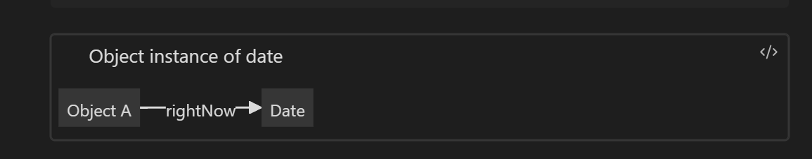
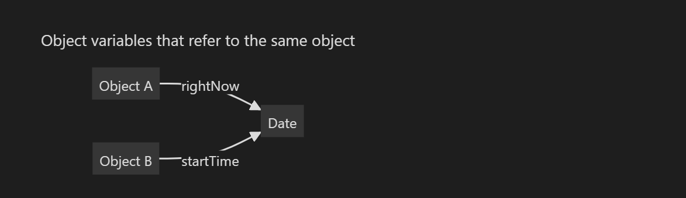

## 10/02
# Using Predefined Classes
## 4.1 Introduction to Object Oriented Programming
In Java, we have predefined classes such as:
		- Math library contains classes
``` java
		 math.random()
 ```


## 4.2.1 Objects and Object Variables
To work with objects, you first construct them and specify their initial state. Then you apply methods to the objects.

In the Java programming language, you use constructors to construct new instances. A constructor is a special method whose purpose is to construct and initialize objects.

> Why use a class to represent dates rather than (as in some languages) a built-in type? For example, Visual Basic has a built-in date type, and programmers can specify dates in the format # #12/31/1999# #.

#### Constructor
Constructors always have the same name as the class name. Thus, the constructor for the Date class is called Date. To construct a Date object, combine the constructor with the new operator, as follows:

```java
new Date() // new object of date class

```

This expression constructs a new object. The object is initialized to the current date and time. If you like, you can pass the object to a method

```java
System.out.println(new Date());
```

Alternatively, you can apply a method to the object that you just constructed. One of the methods of the Date class is the toString method. That method yields a string representation of the date. Here is how you would apply the toString method to a newly constructed Date object:

```java
String date =new Date().toString();
```

#### Creating reusable objects

```java
Date rightNow= new Date();
```



There is an important difference between objects and object variables. For example, the statement 
```java
Date startTime; //startTime doesn't refer to any object 
```


defines an object variable, ==*startTime*==, that can refer to objects of type Date. 

It is important to realize that the variable *startTime* is not an object and, in fact, does not even refer to an object yet. You cannot use any Date methods on this variable at this time. The statement 
```java
s= startTime.toString(); //not yet would cause a compile-time error. 
```

You must first initialize the *startTime* variable. You have two choices. 
Of course, you can initialize the variable so that it refers to a newly constructed object: 
```java
startTime= new Date();
```

Or you can set the variable to refer to an existing object: 
```java
 startTime= rightNow; 
```

Now both variables refer to the same object




### Objects
In Java, the value of any object variable is a reference to an object that is stored elsewhere. The return value of the new operator is also a reference. A statement such as 

```java
Date startTime =new Date(); 
```

has two parts. The expression *==new Date()==* makes an object of type *Date*, and its value is a reference to that newly created object. That reference is then stored in the *startTime* variable


## 4.2.2 The *LocalDate* Class of the Java Library

The library designers decided to separate the concerns of keeping time and attaching names to points in time. Therefore, the standard Java library contains two separate classes: the Date class, which represents a point in time, and the *LocalDate* class, which expresses days in the familiar calendar notation.

You do not use a constructor to construct objects of the *LocalDate* class. Instead, use static *factory methods* that call constructors on your behalf. The expression 

```java
LocalDate.now()
```
You can construct an object for a specific date by supplying year, month, and day: 
```java
LocalDate.of(1999,12,31)
```

```java
LocalDatenewYearsEve = LocalDate.of(1999, 12, 31); // Store local date
int year =newYearsEve.getYear();//1999 
int month= newYearsEve.getMonthValue(); // 12 
int day =newYearsEve.getDayOfMonth(); //31
```

This may seem pointless because they are the very same values that you just used to construct the object. But sometimes, you have a date that has been computed, and then you will want to invoke those methods to find out more about it.

```java
LocalDate aThousandDaysLater = newYearsEve.plusDays(1000); 
year =aThousandDaysLater.getYear(); //2002 
month = aThousandDaysLater.getMonthValue(); // 09 
day = aThousandDaysLater.getDayOfMonth(); //26
```


> [!NOTE] Local Time
> The LocalDate class has encapsulated instance fields to maintain the date to which it is set.

#### 4.2.3 Mutator and Accessor Methods

Consider the plusDays method call that you saw in the preceding section: 
```java
LocalDate aThousandDaysLater=newYearsEve.plusDays(1000);

```

> [!Question]
> What happens to newYearsEve after the call? 
> Has it been changed to be a thousand days later? 

As it turns out, it has not. The *plusDays* method yields a new LocalDate object, which is then assigned to the aThousandDaysLater variable. The original object remains unchanged. We say that the plusDays method does not mutate the object on which it is invoked.

#### GregorianCalendar

An earlier version of the Java library had a different class for dealing with calendars, called GregorianCalendar.

```java
GregorianCalendar someDay=newGregorianCalendar(1999,11, 31); 
// oddfeature ofthatclass: month numbers go from 0 to 11
someDay.add(Calendar.DAY_OF_MONTH, 1000);

```
the GregorianCalendar.add method is a mutatormethod. After invoking it, the state of the someDay object has changed. Here is how you can find out the new state:

```java
year=someDay.get(Calendar.YEAR); // 2002 
month = someDay.get(Calendar.MONTH) + 1; // 09 
day = someDay.get(Calendar.DAY_OF_MONTH);//26 
```

That’s why the variable is called someDay and not newYearsEve—it no longer is new year’s eve after calling the mutator method.

In contrast, methods that only access objects without modifying them are sometimes called *accessor methods.* For example, LocalDate.getYear and GregorianCalendar.get are *accessor methods.*

```java
import java.time.*;
public class CalendarTest
{
   public static void main(String[] args)
   {
      LocalDate date = LocalDate.now();
      int month = date.getMonthValue();
      int today = date.getDayOfMonth();

      date = date.minusDays(today - 1); // set to start of month
      DayOfWeek weekday = date.getDayOfWeek();
      int value = weekday.getValue(); // 1 = Monday, . . . , 7 = Sunday

      System.out.println("Mon Tue Wed Thu Fri Sat Sun");
      for (int i = 1; i < value; i++)
         System.out.print("    ");
      while (date.getMonthValue() == month)
      {
         System.out.printf("%3d", date.getDayOfMonth());
         if (date.getDayOfMonth() == today)
            System.out.print("*");
         else
            System.out.print(" ");
         date = date.plusDays(1);
         if (date.getDayOfWeek().getValue() == 1) System.out.println();
      }
      if (date.getDayOfWeek().getValue() != 1) System.out.println();
   }
}
//java.time.LocalDate
```
